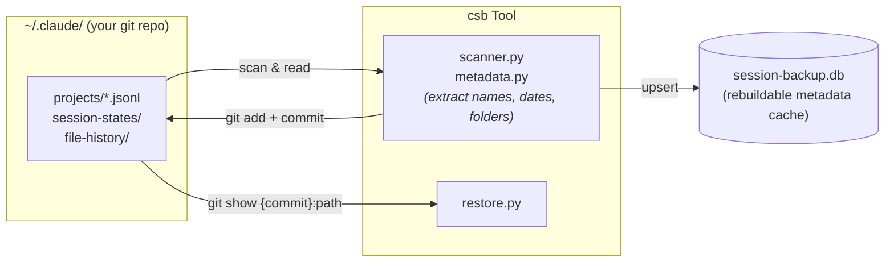

# Claude-Session-Backup

[](https://pypi.org/project/claude-session-backup/)
[](https://github.com/DazzleML/Claude-Session-Backup/releases)
[](https://www.python.org/downloads/)
[](https://www.gnu.org/licenses/gpl-3.0.html)
[](https://dazzleml.github.io/Claude-Session-Backup/stats/#installs)
[](docs/platforms.md)

**Git-backed Claude Code session backup with timeline view, folder analysis, deletion detection, and session restore.**

## The Problem

Claude Code stores session data in `~/.claude/projects/` as JSONL files. These can be silently deleted during upgrades, lossy-compacted via `/compact`, or lost when session compatibility breaks between versions. Once gone, your conversation history -- including debugging sessions, architectural decisions, and code review context -- is unrecoverable.

**csb** preserves every session in your existing `~/.claude` git repository, builds a searchable metadata index, detects deletions, and can restore lost sessions from git history.

> [!WARNING]
> **Prealpha software.** `csb` is functional and all tests pass, but it is not yet feature-complete and has not been broadly tested outside of active dogfooding. Expect bugs, rough edges, and breaking changes until the first alpha/beta releases. Three items gate the next milestone: distilled conversation backup (#12), end-to-end restore verification (#13), and a CLI launcher for claude-code-history-viewer (#14). By all means use it -- and please file issues -- but don't rely on `csb` as your only backup just yet.

## Quick Start

```bash
# 1. Install the CLI (PyPI release coming shortly)
pip install git+https://github.com/DazzleML/Claude-Session-Backup.git

# 2. (recommended) Install the Claude Code plugin so pre-compact backups fire
#    automatically. Full commands in the "Claude Code Plugin" section below.

# 3. Scan all sessions and build the index (no git commits)
csb backup --no-commit

# 4. See your session timeline
csb list

# 5. Full backup with git commits (noise + user, separate commits, unsigned)
csb backup
```

## Features

- **Full session preservation**: Every byte of JSONL, subagent data, tool results backed up via git
- **Timeline view**: Sessions sorted by last use with relative dates, start folder, and top N working directories
- **Folder analysis**: See where work actually happened -- the most-used folder is highlighted
- **Deletion detection**: Know when Claude Code removes a session you previously tracked
- **Session restore**: Recover deleted sessions from git history with `csb restore`
- **Two-commit model**: Noise (transient state) and user (configs, skills) committed separately
- **Unattended operation**: `--no-gpg-sign`, `--quiet`, lock file -- designed for cron and Task Scheduler
- **Cross-platform**: Works on Windows, Linux, macOS, BSD

## Commands

```bash
csb backup                            # Scan, index, git commit (noise + user)
csb backup --no-commit                # Scan and index only
csb list [-n 20]                      # Timeline view (default sort: last-used)
csb list [keyword]                    # Filter by keyword in name/project/folders
csb list --sort expiration            # Sort by soonest-to-purge first
csb list --sort {last-used|expiration|started|oldest|messages|size}
csb list --deleted                    # Show deleted sessions
csb scan                              # Find sessions touching cwd (path-prefix)
csb scan <term>                       # Filter by term: name, project, folder paths
csb scan ./<dirname>                  # Shortcut: same as -d <dirname> (no flag to remember)
csb scan -d <pattern>                 # Path-strict: folder + descendants
csb scan -D <pattern>                 # Path-strict: this folder only, no descendants
csb scan -s <pattern>                 # start_folder only ("what sessions originated here?")
csb scan -d <pattern> <term>          # Scope-then-filter combined
csb scan -d <pattern>* / -D <pattern>* / -s <pattern>*  # Trailing-* wildcard
csb scan ... -NU                      # Skip folder-usage search (start_folder only)
csb status                            # Summary stats
csb show <session-id>                 # Detailed session info with folder analysis
csb search "query"                    # Search transcript content (USER/AI/AGENT messages)
csb search -E "regex.*pattern"        # Regex mode (Python re)
csb search "X" -C 3                   # Show 3 events of context before AND after each hit
csb search "X" -A 5 -B 2              # Asymmetric context (5 after, 2 before)
csb search "X" --source convo         # Force a source channel; auto = convo > sesslog > jsonl
csb search "X" --session <uuid>       # Constrain to one session by UUID prefix
csb search "X" --json                 # NDJSON output for piping into jq
csb restore <session-id>              # Restore deleted session from git history
csb resume <session-id>               # Launch claude --resume with full UUID
csb rebuild-index                     # Reconstruct SQLite from scratch
csb config [key] [value]              # View/edit configuration
```

### Searching conversations

Use `csb search` to find old sessions by **what was discussed**, not just by folder or name. The query is a case-insensitive literal substring by default; `-E` switches to Python regex.

```bash
# Find every session where you talked about OAuth callbacks
csb search "oauth callback"

# Regex with context (3 events above and below each hit)
csb search -E "refresh.*token" -C 3

# Constrain to one session and one source channel
csb search "auth flow" --session 916441e6 --source convo

# Pipe results into another tool
csb search "rate limit" --json | jq -r '.session_id' | sort -u
```

Per-session source preference is `.convo*` (preferred, USER/AI/AGENT-only) -> `.sesslog*` (filtered to USER/AI/AGENT) -> `<uuid>.jsonl` (authoritative fallback). New sessions logged by [claude-session-logger](https://github.com/DazzleML/claude-session-logger) get the cleanest `.convo*` source; older sessions fall through to JSONL automatically. Hits are sorted by session last-used time, so the most recent matches surface first.

For metadata search (folder paths, project, session name), use `csb list <filter>` or `csb scan <term>` -- those are the right tools for "find sessions in this folder" rather than "find sessions about this topic."

### Finding sessions at risk of purge

Claude Code auto-deletes sessions after `cleanupPeriodDays` (default 30). To see which of your sessions are closest to being purged:

```bash
csb list --sort expiration -n 20
```

Sessions are sorted by the JSONL file's modification time, so active sessions (which refresh their mtime on every interaction) stay safe while dormant sessions surface to the top of the expiration list.

## How It Works



**Key principle**: Git is the source of truth. The SQLite database is a rebuildable index for fast queries. If the DB is lost, `csb rebuild-index` reconstructs it from git history.

## Automation

### Claude Code Plugin (recommended)

The repository ships as a Claude Code plugin that registers PreCompact and SessionEnd hooks automatically. You can install it straight from GitHub -- no clone required:

```bash
# Add the DazzleML marketplace (one-time)
claude plugin marketplace add "DazzleML/Claude-Session-Backup"

# Install the plugin
claude plugin install claude-session-backup@dazzle-claude-session-backup
```

Alternatively, if you already have a clone for development:

```bash
# From a clone of this repo
claude plugin marketplace add ./
claude plugin install claude-session-backup@dazzle-claude-session-backup
```

The plugin uses a Node.js bootstrapper (`run-hook.mjs`) to find the correct Python binary on each platform, so it works reliably on Windows, Linux, and macOS without any shell quoting concerns. PreCompact fires synchronously before `/compact` to preserve full conversation detail; SessionEnd fires on exit to catch any remaining changes.

### Manual hook installation

If you prefer to manage hooks yourself, add this to `~/.claude/settings.json`:

```json
{
  "hooks": {
    "PreCompact": [{"hooks": [{"type": "command", "command": "csb backup --quiet"}]}],
    "SessionEnd": [{"hooks": [{"type": "command", "command": "csb backup --quiet &"}]}]
  }
}
```

Or use `python install.py` in the repo to copy the hook script and print the snippet.

### Cron (Linux/Mac)

Belt-and-suspenders periodic backup as a safety net:

```bash
*/15 * * * * /usr/local/bin/csb backup --quiet 2>/dev/null
```

### Task Scheduler (Windows)

```powershell
schtasks /create /tn "Claude Session Backup" /tr "csb backup --quiet" /sc minute /mo 15
```

## Recovery

When Claude Code purges a session you wanted to keep, csb can recover it from your `~/.claude` git history. The restore path is **byte-exact** regardless of host git's `core.autocrlf` settings, on every platform csb supports.

### Finding what was deleted

```bash
csb list --deleted                  # Every session csb has flagged deleted, all projects
csb list amd --deleted              # Filtered: only deleted sessions matching "amd"
csb scan --deleted                  # Deleted sessions touching cwd (or any folder)
csb scan -d /path/to/proj --deleted # Scoped to a specific folder (folder + descendants)
csb scan --deleted --all-folders    # Don't truncate the per-session folder list
```

The default `csb list` and `csb scan` hide deleted sessions (active-only view); the bottom of `csb list` shows a one-line footer when there are deleted sessions matching your filter so you don't have to remember to check.

### Recovering one session

```bash
csb restore <session-uuid>          # Full UUID required when DB has no row for it
csb restore <prefix>                # Prefix works when the session IS in csb's DB
csb restore <uuid> --dry-run        # Preview commit + target path without writing
```

If csb's DB doesn't have a row for the session (e.g., after `csb rebuild-index`, or on a fresh machine), `csb restore` falls back to walking `git log --all` for `projects/*/<uuid>.jsonl`. It needs the full UUID for the fallback path.

### Recovering many sessions at once

```bash
csb scan -d <pattern> --deleted --restore --dry-run    # Preview the whole set
csb scan -d <pattern> --deleted --restore              # Confirm prompt for >1 file
csb scan -d <pattern> --deleted --restore --yes       # Skip the prompt
csb scan -d <pattern> --deleted --restore --force     # Overwrite existing on-disk files
```

Bulk restore takes the same `backup_lock` as `csb backup`, so it won't race a concurrent backup. Per-file status (`OK` / `SKIP` / `FAIL`) is printed; the final line summarizes counts.

### What csb restore does NOT do

- It does NOT modify any other Claude Code state files. Only the JSONL is written back to its original `projects/<slug>/<uuid>.jsonl` location.
- It does NOT preserve the original mtime — restored files have `mtime=now` (a known limitation; affects the `--sort expiration` view until the next backup cycle).
- It does NOT (yet) restore subagent or tool-result subdirectory contents alongside the JSONL — separate follow-up if testing shows the JSONL alone isn't enough for `claude --resume`.

## Requirements

- **Python 3.10+**
- **Git** (for backup storage)
- **`~/.claude/`** initialized as a git repository (`git -C ~/.claude init`)

## Installation

```bash
# From GitHub (recommended until PyPI publish lands)
pip install git+https://github.com/DazzleML/Claude-Session-Backup.git

# From source (development / contributing)
git clone https://github.com/DazzleML/Claude-Session-Backup.git
cd Claude-Session-Backup
pip install -e ".[dev]"

# From PyPI (once published)
pip install claude-session-backup
```

## Contributing

Contributions welcome! See [CONTRIBUTING.md](CONTRIBUTING.md).

## Acknowledgements

This project draws inspiration and patterns from:

- **[claude-vault](https://github.com/kuroko1t/claude-vault)** by [@kuroko1t](https://github.com/kuroko1t) -- FTS5 search design, JSONL parsing patterns, Claude Code hook integration. Their [blog post](https://dev.to/kuroko1t/i-built-a-tool-to-stop-losing-my-claude-code-conversation-history-5500) was the catalyst for this project.
- **[claude-code-history-viewer](https://github.com/jhlee0409/claude-code-history-viewer)** by [@jhlee0409](https://github.com/jhlee0409) -- Full JSONL data model understanding, session file structure documentation, file restore patterns.
- **[claude-session-logger](https://github.com/DazzleML/claude-session-logger)** by [@djdarcy](https://github.com/djdarcy) -- Real-time session logging, session naming conventions, session-state file handling.

## License

Claude-Session-Backup, Copyright (C) 2026 Dustin Darcy

Licensed under the [GNU General Public License v3.0](https://www.gnu.org/licenses/gpl-3.0.html) (GPL-3.0) -- see [LICENSE](LICENSE)
