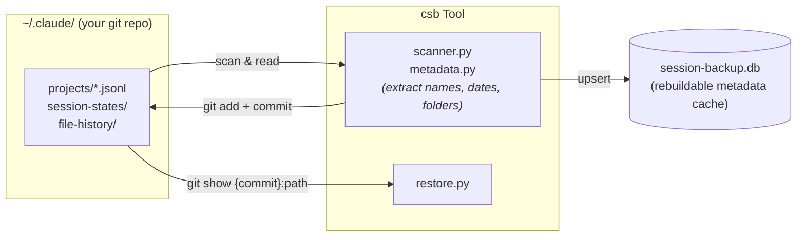

# Claude-Session-Backup

[](https://pypi.org/project/claude-session-backup/)
[](https://github.com/DazzleML/Claude-Session-Backup/releases)
[](https://www.python.org/downloads/)
[](https://www.gnu.org/licenses/gpl-3.0.html)
[](https://dazzleml.github.io/Claude-Session-Backup/stats/#installs)
[](docs/platforms.md)

**Git-backed Claude Code session backup with timeline view, folder analysis, deletion detection, and session restore.**

## The Problem

Claude Code stores session data in `~/.claude/projects/` as JSONL files. These can be silently deleted during upgrades, lossy-compacted via `/compact`, or lost when session compatibility breaks between versions. Once gone, your conversation history -- including debugging sessions, architectural decisions, and code review context -- is unrecoverable.

**csb** preserves every session in your existing `~/.claude` git repository, builds a searchable metadata index, detects deletions, and can restore lost sessions from git history.

> [!NOTE]
> **Alpha software (cusp of beta) -- nearly feature-complete.** Everything on the original roadmap has shipped: backup, deletion detection, content search (JSONL+sesslogs+FTS5), full session restore (a deleted session's complete footprint recovered from git -- transcript, subagents, tool-results, logger sesslogs -- with original timestamps and symlinks, resumable in Claude Code), a viewer launcher (`csb view`), and a human-readable chat-log layer (`csb distill`).
>
> Staying alpha a little longer while the tires get kicked; beta follows once v0.4.0 has settled. Expect occasional rough edges and breaking changes between minor versions until then. By all means use it (and please [file issues](https://github.com/DazzleML/Claude-Session-Backup/issues)) but, as with any backup tool, keep a second copy of anything irreplaceable.

## Quick Start

Three commands install everything -- the CLI plus the Claude Code plugin that fires backups automatically on PreCompact and SessionEnd:

```bash
# 1. Install the csb CLI
pip install claude-session-backup

# 2. Add the DazzleML marketplace (one-time)
claude plugin marketplace add "DazzleML/Claude-Session-Backup"

# 3. Install the plugin -- registers the PreCompact + SessionEnd hooks
claude plugin install claude-session-backup@dazzle-claude-session-backup
```

Then verify it works:

```bash
# Build the index from existing sessions (no git commits yet)
csb backup --no-commit

# See your session timeline
csb list

# Full backup with git commits (separate noise + user commits, unsigned)
csb backup
```

> [!TIP]
> **Pair with [claude-session-logger](https://github.com/DazzleML/claude-session-logger/)** for full searchable history. csb preserves Claude Code's session transcripts (`projects/<slug>/<uuid>.jsonl`). The logger captures the *richer* per-session data alongside them -- tool calls, shell commands, agent dispatches -- written to `~/.claude/sesslogs/`. csb backs up those logger files too (it backs up everything under `~/.claude/` via the noise commits), and `csb restore` brings the whole footprint back together: transcript + subagents + tool-results + logger state + sesslogs. The two projects are independent (csb works fine without the logger) but they're designed to complement each other.

## Features

- **Full session preservation**: Every byte of JSONL, subagent data, tool results backed up via git
- **Timeline view**: Sessions sorted by last use with relative dates, start folder, and top N working directories
- **Folder analysis**: See where work actually happened -- the most-used folder is highlighted
- **Deletion detection**: Know when Claude Code removes a session you previously tracked
- **Session restore**: Recover deleted sessions from git history with `csb restore`
- **Readable chat logs**: `csb distill` renders any session as an IM-style log -- the full JSONL stays preserved regardless
- **Two-commit model**: Noise (transient state) and user (configs, skills) committed separately
- **Unattended operation**: `--no-gpg-sign`, `--quiet`, lock file -- designed for cron and Task Scheduler
- **Cross-platform**: Works on Windows, Linux, macOS, BSD

## Commands

The daily drivers:

```bash
csb backup                      # Scan, index, git commit
csb list                        # Timeline of sessions (filter, sort, --deleted)
csb scan -d <path> --deleted    # Find (and bulk-restore) what was purged in a folder
csb search "oauth callback"     # Full-text search across every conversation
csb distill <query>             # Read a session as a chat log -> ~/.claude/distilled/
csb resume <query>              # Reopen in Claude Code (UUID, prefix, name, keyword...)
csb view <query>                # Open in Claude Code History Viewer
csb restore <session-id>        # Recover a deleted session from git history
csb status                      # Summary stats
```

Every command, every flag, and the deep dives live in **[docs/commands.md](docs/commands.md)**.

### Searching conversations

`csb search` finds old sessions by **what was discussed**, not just by folder or name -- sub-second across tens of thousands of messages via per-project FTS5 indexes (run `csb update build-fts5` once to build them).

```bash
csb search "oauth callback"                 # literal substring, case-insensitive
csb search -E "refresh.*token" -C 3         # regex, with 3 events of context
```

Full details (what's indexed, source channels, JSON output, freshness semantics): **[docs/commands.md](docs/commands.md#searching-conversations)**.

### Reading conversations (distill)

`csb search` finds the needle; `csb distill` lets you read the haystack comfortably -- an instant-messenger-style log with timestamped speaker turns (`<User>`, `<Claude>`, `<Agent:explore>`) and one-line tool calls instead of walls of tool output. Markdown-friendly (Typora) and editor-friendly (Vim).

```bash
csb distill <anything-that-identifies-a-session>     # writes ~/.claude/distilled/<slug>/<uuid>.md
```

The distilled file is a *reading layer* -- the full JSONL remains the preserved record. Filters, channels, and the `distill_policy` config: **[docs/commands.md](docs/commands.md#reading-conversations-distill)**.

### Recovery

When Claude Code purges a session you wanted to keep, csb recovers it from git history **byte+metadata-exact**: the full footprint (transcript, subagents, tool-results, logger files), recreated symlinks, and original timestamps -- a recovered session is indistinguishable from one that was never deleted. `resume`/`view`/`distill` all offer the restore inline when they hit a pruned session.

```bash
csb list --deleted                                   # what's gone?
csb restore <session-id>                             # bring one back
csb scan -d <path> --deleted --restore --dry-run     # preview a bulk recovery
```

Single + bulk recovery, guarantees and limits, purge-TTL management: **[docs/commands.md](docs/commands.md#recovery)**. Maintenance verbs (`csb update *`): **[docs/maintenance.md](docs/maintenance.md)**.

## How It Works



**Key principle**: Git is the source of truth. The SQLite database is a rebuildable index for fast queries. If the DB is lost or corrupted, `csb update rebuild-index` reconstructs it while preserving deleted-session metadata. See [`docs/maintenance.md`](docs/maintenance.md) for the `csb update` family of maintenance verbs.

## Automation

The Claude Code plugin (from Quick Start above) covers most users: PreCompact fires before `/compact`, SessionEnd on exit. For manual hooks, cron, Task Scheduler, and distill-on-backup, see **[docs/automation.md](docs/automation.md)**.

## Requirements

- **Python 3.10+**
- **Git** (for backup storage)
- **`~/.claude/`** initialized as a git repository (`git -C ~/.claude init`)

## Installation

```bash
# From PyPI (recommended)
pip install claude-session-backup

# Latest unreleased build from GitHub
pip install git+https://github.com/DazzleML/Claude-Session-Backup.git

# From source (development / contributing)
git clone https://github.com/DazzleML/Claude-Session-Backup.git
cd Claude-Session-Backup
pip install -e ".[dev]"
```

Full documentation index: **[docs/README.md](docs/README.md)**.

## Contributing

Contributions welcome! Please open an issue or submit a pull request.

See **[CONTRIBUTING.md](CONTRIBUTING.md)** for:
- Development setup (`pip install -e ".[dev]"`)
- Running the test suite and human test checklists (`tests/checklists/`)
- Version management with `sync-versions.py`
- Pull request checklist

Like the project?

[](https://www.buymeacoffee.com/djdarcy)

## Related Projects

- [claude-session-logger](https://github.com/DazzleML/claude-session-logger) - Real-time per-session tool/conversation logging; csb backs up and restores its files, and its session naming + state-file conventions shaped csb's
- [dazzle-filekit](https://github.com/DazzleLib/dazzle-filekit) - Cross-platform file operations toolkit (symlink recreation, timestamp restore)

## Acknowledgements

- [claude-vault](https://github.com/kuroko1t/claude-vault) by [@kuroko1t](https://github.com/kuroko1t) -- FTS5 search design, JSONL parsing patterns, Claude Code hook integration. Serendipitously started work on `csb` a week or so before [kuroko1t's blog post](https://dev.to/kuroko1t/i-built-a-tool-to-stop-losing-my-claude-code-conversation-history-5500).
- [claude-code-history-viewer](https://github.com/jhlee0409/claude-code-history-viewer) by [@jhlee0409](https://github.com/jhlee0409) - GUI session reader that `csb view` launches.

## License

Claude-Session-Backup, Copyright (C) 2026 Dustin Darcy

Licensed under the [GNU General Public License v3.0](https://www.gnu.org/licenses/gpl-3.0.html) (GPL-3.0) -- see [LICENSE](LICENSE)
