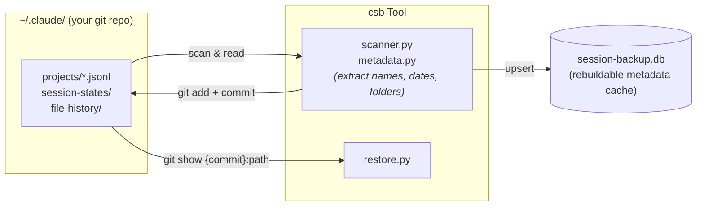

# Claude-Session-Backup

[](https://pypi.org/project/claude-session-backup/)
[](https://github.com/DazzleML/Claude-Session-Backup/releases)
[](https://www.python.org/downloads/)
[](https://www.gnu.org/licenses/gpl-3.0.html)
[](https://github.com/DazzleML/Claude-Session-Backup)
[](docs/platforms.md)

**Git-backed Claude Code session backup with timeline view, folder analysis, deletion detection, and session restore.**

## The Problem

Claude Code stores session data in `~/.claude/projects/` as JSONL files. These can be silently deleted during upgrades, lossy-compacted via `/compact`, or lost when session compatibility breaks between versions. Once gone, your conversation history -- including debugging sessions, architectural decisions, and code review context -- is unrecoverable.

**csb** preserves every session in your existing `~/.claude` git repository, builds a searchable metadata index, detects deletions, and can restore lost sessions from git history.

## Quick Start

```bash
pip install claude-session-backup

# Scan all sessions and build the index (no git commits)
csb backup --no-commit

# See your session timeline
csb list

# Full backup with git commits (noise + user, separate commits, unsigned)
csb backup
```

## Features

- **Full session preservation**: Every byte of JSONL, subagent data, tool results backed up via git
- **Timeline view**: Sessions sorted by last use with relative dates, start folder, and top N working directories
- **Folder analysis**: See where work actually happened -- the most-used folder is highlighted
- **Deletion detection**: Know when Claude Code removes a session you previously tracked
- **Session restore**: Recover deleted sessions from git history with `csb restore`
- **Two-commit model**: Noise (transient state) and user (configs, skills) committed separately
- **Unattended operation**: `--no-gpg-sign`, `--quiet`, lock file -- designed for cron and Task Scheduler
- **Cross-platform**: Works on Windows, Linux, macOS, BSD

## Commands

```bash
csb backup                            # Scan, index, git commit (noise + user)
csb backup --no-commit                # Scan and index only
csb list [-n 20]                      # Timeline view (default sort: last-used)
csb list [keyword]                    # Filter by keyword in name/project/folders
csb list --sort expiration            # Sort by soonest-to-purge first
csb list --sort {last-used|expiration|started|oldest|messages|size}
csb list --deleted                    # Show deleted sessions
csb scan [path]                       # Find sessions touching this directory
csb scan [path] -NU                   # Prefix-only match (skip folder-usage search)
csb status                            # Summary stats
csb show <session-id>                 # Detailed session info with folder analysis
csb search "query"                    # Search by session name, project, or folder
csb restore <session-id>              # Restore deleted session from git history
csb resume <session-id>               # Launch claude --resume with full UUID
csb rebuild-index                     # Reconstruct SQLite from scratch
csb config [key] [value]              # View/edit configuration
```

### Finding sessions at risk of purge

Claude Code auto-deletes sessions after `cleanupPeriodDays` (default 30). To see which of your sessions are closest to being purged:

```bash
csb list --sort expiration -n 20
```

Sessions are sorted by the JSONL file's modification time, so active sessions (which refresh their mtime on every interaction) stay safe while dormant sessions surface to the top of the expiration list.

## How It Works



**Key principle**: Git is the source of truth. The SQLite database is a rebuildable index for fast queries. If the DB is lost, `csb rebuild-index` reconstructs it from git history.

## Automation

### Claude Code Plugin (recommended)

The repository ships as a Claude Code plugin that registers PreCompact and SessionEnd hooks automatically:

```bash
# From a clone of this repo
claude plugin marketplace add ./
claude plugin install claude-session-backup@dazzle-claude-session-backup
```

The plugin uses a Node.js bootstrapper (`run-hook.mjs`) to find the correct Python binary on each platform, so it works reliably on Windows, Linux, and macOS without any shell quoting concerns. PreCompact fires synchronously before `/compact` to preserve full conversation detail; SessionEnd fires on exit to catch any remaining changes.

### Manual hook installation

If you prefer to manage hooks yourself, add this to `~/.claude/settings.json`:

```json
{
  "hooks": {
    "PreCompact": [{"hooks": [{"type": "command", "command": "csb backup --quiet"}]}],
    "SessionEnd": [{"hooks": [{"type": "command", "command": "csb backup --quiet &"}]}]
  }
}
```

Or use `python install.py` in the repo to copy the hook script and print the snippet.

### Cron (Linux/Mac)

Belt-and-suspenders periodic backup as a safety net:

```bash
*/15 * * * * /usr/local/bin/csb backup --quiet 2>/dev/null
```

### Task Scheduler (Windows)

```powershell
schtasks /create /tn "Claude Session Backup" /tr "csb backup --quiet" /sc minute /mo 15
```

## Requirements

- **Python 3.10+**
- **Git** (for backup storage)
- **`~/.claude/`** initialized as a git repository (`git -C ~/.claude init`)

## Installation

```bash
# From PyPI
pip install claude-session-backup

# From source (development)
git clone https://github.com/DazzleML/Claude-Session-Backup.git
cd Claude-Session-Backup
pip install -e ".[dev]"
```

## Contributing

Contributions welcome! See [CONTRIBUTING.md](CONTRIBUTING.md).

## Acknowledgements

This project draws inspiration and patterns from:

- **[claude-vault](https://github.com/kuroko1t/claude-vault)** by [@kuroko1t](https://github.com/kuroko1t) -- FTS5 search design, JSONL parsing patterns, Claude Code hook integration. Their [blog post](https://dev.to/kuroko1t/i-built-a-tool-to-stop-losing-my-claude-code-conversation-history-5500) was the catalyst for this project.
- **[claude-code-history-viewer](https://github.com/pinkpixel-dev/claude-code-history-viewer)** by [@pinkpixel-dev](https://github.com/pinkpixel-dev) -- Full JSONL data model understanding, session file structure documentation, file restore patterns.
- **[claude-session-logger](https://github.com/DazzleML/claude-session-logger)** by [@djdarcy](https://github.com/djdarcy) -- Real-time session logging, session naming conventions, session-state file handling.

## License

Claude-Session-Backup, Copyright (C) 2026 Dustin Darcy

Licensed under the [GNU General Public License v3.0](https://www.gnu.org/licenses/gpl-3.0.html) (GPL-3.0) -- see [LICENSE](LICENSE)
