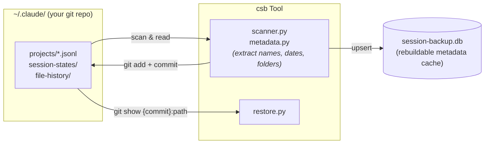

# Claude-Session-Backup

[](https://pypi.org/project/claude-session-backup/)
[](https://github.com/DazzleML/Claude-Session-Backup/releases)
[](https://pypistats.org/packages/claude-session-backup)
[](https://www.python.org/downloads/)
[](https://www.gnu.org/licenses/gpl-3.0.html)
[](https://github.com/DazzleML/Claude-Session-Backup/discussions)
[](https://dazzleml.github.io/Claude-Session-Backup/stats/#installs)
[](docs/platforms.md)

**Git-backed Claude Code session backup with timeline view, folder analysis, deletion detection, and session restore.**

## The Problem

Claude Code stores session data in `~/.claude/projects/` as JSONL files. These can be silently deleted during upgrades, [lossy](https://github.com/jhlee0409/claude-code-history-viewer/issues/238#issuecomment-4199548325)-[compacted](https://platform.claude.com/docs/en/build-with-claude/compaction) via [/compact](https://code.claude.com/docs/en/commands#:~:text=/compact%20%5Binstructions%5D,and%20memory%20files), or lost when session compatibility breaks between versions. Once gone, your conversation history -- including debugging sessions, architectural decisions, and code review context -- is unrecoverable.

**csb** preserves every session in your existing `~/.claude` git repository, builds a searchable metadata index, detects deletions, and can restore lost sessions from git history.

> [!NOTE]
> **Beta (as of v0.6.0) -- feature-complete and in daily use.** Everything on the original roadmap has shipped: backup, deletion detection, content search (JSONL+sesslogs+FTS5), full session restore (a deleted session's complete footprint recovered from git -- transcript, subagents, tool-results, logger sesslogs -- with original timestamps and symlinks, resumable in Claude Code), a viewer launcher (`csb view`), a human-readable chat-log layer (`csb distill`), and guided onboarding (`csb setup`).
>
> Beta means the tool works well for real daily use, not that the interface is frozen. Breaking changes may still happen between versions when the design calls for it. Please [file issues](https://github.com/DazzleML/Claude-Session-Backup/issues) for anything rough. And, as with any backup tool, keep a second copy of anything truly irreplaceable.

## Quick Start

Four commands install everything -- the CLI, the git store that holds the backups, and the Claude Code plugin that fires backups automatically on PreCompact and SessionEnd:

```bash
# 1. Install the csb CLI
pip install claude-session-backup

# 2. Guided setup -- detects/initializes the git backup store, hardens
#    .gitattributes, and runs your first backup. (`csb setup --auto` for
#    scripts; until setup completes, every csb run reminds you loudly.)
csb setup

# 3. Add the DazzleML marketplace (one-time)
claude plugin marketplace add "DazzleML/Claude-Session-Backup"

# 4. Install the plugin -- registers the PreCompact + SessionEnd hooks
claude plugin install claude-session-backup@dazzle-claude-session-backup
```

Then verify it works:

```bash
# Build the index from existing sessions (no git commits yet)
csb backup --no-commit

# See your session timeline
csb list

# Full backup with git commits (separate noise + user commits, unsigned)
csb backup
```

> [!TIP]
> **Pair with [claude-session-logger](https://github.com/DazzleML/claude-session-logger/)** for full searchable history. csb preserves Claude Code's session transcripts (`projects/<slug>/<uuid>.jsonl`). The logger captures the *richer* per-session data alongside them -- tool calls, shell commands, agent dispatches -- written to `~/.claude/sesslogs/`. csb backs up those logger files too (it backs up everything under `~/.claude/` via the noise commits), and `csb restore` brings the whole footprint back together: transcript + subagents + tool-results + logger state + sesslogs. The two projects are independent (csb works fine without the logger) but they're designed to complement each other.

## Features

- **Findable sessions**: hand-name each one with `/rename` as you start it, using `PROJECT__DATE__topic` -- `csb list`/`tree`/`resume` then become instant project views instead of content searches. See [naming](docs/naming.md)
- **Guided setup**: `csb setup` configures the git backup store (detects ancestor repos, `--auto` for scripts) and closes with a state-aware checklist -- running unprotected requires an explicit `--index-only` sign-off, or csb reminds you on every run
- **Full session preservation**: Every byte of JSONL, subagent data, tool results backed up via git
- **Timeline view**: Sessions sorted by last use with relative dates, start folder, and top N working directories
- **Folder analysis**: See where work actually happened -- the most-used folder is highlighted
- **Deletion detection**: Know when Claude Code removes a session you previously tracked
- **Session restore**: Recover deleted sessions from git history with `csb restore`
- **Readable chat logs**: `csb distill` renders any session as an IM-style log -- the full JSONL stays preserved regardless
- **Fork lineage**: `csb tree` shows which session spawned which as an indented tree -- including purged ancestors csb still remembers, so a chain never reads headless
- **Restart recovery**: `csb set show last` reconstructs which sessions were active before the machine's last shutdown -- the Windows Update special, answered from the event log and the index, with a paste-able resume command per row
- **Live session tracking**: `csb set show current` knows what is open *right now* -- csb's hooks register every session on start and erase the record on clean close, so leftovers are crash evidence, `csb set new NAME --from current` freezes the group, and `csb resume --set NAME` lists what's left to reclaim
- **Two-commit model**: Noise (transient state) and user (configs, skills) committed separately
- **Unattended operation**: `--no-gpg-sign`, `--quiet`, lock file -- designed for cron and Task Scheduler
- **Cross-platform**: Works on Windows, Linux, macOS, BSD

## Commands

The daily drivers:

```bash
csb setup                       # Guided onboarding (git store, first backup, checklist)
csb backup                      # Scan, index, git commit
csb list                        # Timeline of sessions (filter, sort, --deleted)
csb scan -d <path> --deleted    # Find (and bulk-restore) what was purged in a folder
csb search "oauth callback"     # Full-text search across every conversation
csb tree [filter] [path]        # Fork lineage: which session spawned which
csb set show last               # What was active before the last shutdown (restart recovery)
csb set show current            # What is open right now (live registry)
csb distill <query>             # Read a session as a chat log -> ~/.claude/distilled/
csb resume <query>              # Reopen in Claude Code (UUID, prefix, name, keyword...)
csb resume --set <N>            # Reclaim member N of a set, in THIS terminal
csb view <query>                # Open in Claude Code History Viewer
csb restore <session-id>        # Recover a deleted session from git history
csb status                      # Summary stats
```

Every command, every flag, and the nitty-gritties live in **[docs/commands.md](docs/commands.md)**.

### Naming sessions (do this on start)

Every csb lookup (`list`, `scan`, `tree`, `resume`) matches against the session **name**. Claude Code only assigns a UUID, so an unnamed vault is a wall of `3b0924e5-...` that you can only [search](https://github.com/DazzleML/Claude-Session-Backup/blob/main/docs/commands.md#searching-conversations) by *content*. Naming is what makes Claude Code sessions easily browsable, and it's the difference between finding old work in a second or two, versus having to excavate older sessions.

**Hand-name it with `/rename` the moment you walk into a new session**, before any work. Starting a new project you know what you've set out to do; whereas nothing else in the system does yet, and nothing reconstructs it quite as well later. Claude Code then shows that name at the top-right of the text input bar, so it also helps distinguish which Claude window is which when several projects are open at once.

The convention that makes lookups easier and less painful later is this -- **what**, **when**, **about**:

```
PROJECT__DATE__topic-words
```

For example:

```
CLAUDE-SESSION-BACKUP__2026-7-26__add-tree-functionality
DAZZLECMD__2026-7-5__fiber-nuance-with-FQCN
```

The project leads so `csb list DAZZLECMD` and `csb tree "DAZZLECMD*"` anchor on it.

Renaming later is completely safe, so rename if the work drifts and name old sessions after the fact. The **[docs/naming.md](docs/naming.md)** file covers everything else: the separator grammar, `/renameAI` for backlogs of older unclear sessions, the workflow that leaves a searchable trail, naming forks so `csb tree` reads as a narrative, anti-patterns, and more.

### Common workflows

The patterns that come up every day:

```bash
# "What sessions touched THIS project?" -- cd into any folder you were
# working in and ask. The shortcut form needs no flags to remember.
cd ~/code/my-project
csb scan .
csb scan -D .                   # this folder exactly, no subfolders
csb scan -s .                   # only sessions that STARTED here

# "What was I working on before the reboot / crash / weekend?"
csb list -n 5

# "I remember discussing it, but in WHICH session?" -- search by content,
# then read the winner like a chat log.
csb search "rate limiter backoff"
csb distill <uuid-from-the-hit>

# "Pick up exactly where I left off" -- by name, prefix, or keyword.
csb resume MY-PROJECT__2026-6-6__that-refactor

# "Claude Code purged something I needed."
csb list --deleted
csb restore MY-PROJECT__2025-5-25__redesign  #or <session-id / id-fragment>
```

`csb scan --help` groups its flags by what they do -- **selection** (which sessions match), **display** (how each match is shown), and **limits**. `--top` belongs to display and never changes what matches. How `-d` / `-D` / `-s` differ, and when to reach for `-NI` (`--no-index`, the escape hatch that reads transcripts instead of the database): **[docs/commands.md](docs/commands.md#how-csb-scans-scope-flags-relate)**.

### Searching conversations

`csb search` finds old sessions by **what was discussed**, not just by folder or name -- sub-second across tens of thousands of messages via per-project FTS5 indexes (run `csb update build-fts5` once to build them).

```bash
csb search "oauth callback"                 # literal substring, case-insensitive
csb search -E "refresh.*token" -C 3         # regex, with 3 events of context
```

Full details (what's indexed, source channels, JSON output, freshness semantics): **[docs/commands.md](docs/commands.md#searching-conversations)**.

### Reading conversations (distill)

`csb search` finds the needle; `csb distill` lets you read the haystack comfortably, with an instant-messenger-style log with timestamped speaker turns (`<User>`, `<Claude>`, `<Agent:explore>`) and one-line tool calls instead of walls of tool output. Markdown-friendly (Typora) and editor-friendly (Vim / VSCode / etc).

```bash
csb distill <anything-that-identifies-a-session>     # writes ~/.claude/distilled/<slug>/<uuid>.md
```

The distilled file is a *reading layer* -- the full JSONL remains the preserved record. Filters, channels, and the `distill_policy` config: **[docs/commands.md](docs/commands.md#reading-conversations-distill)**.

### Fork lineage (tree)

Forking a session -- `/branch`, continuing a `/rewind`, or `claude --fork-session -r` -- mints a **new** session that inherits the old one's history. `csb tree` shows how they relate:

```
$ csb tree multi-term
CLAUDE-SESSION-BACKUP__adding-transcript-search  2 months ago
└── CLAUDE-SESSION-BACKUP__phase-1-grep-first  2 months ago  forked 2026-05-18, at 09:12
    ├── CLAUDE-SESSION-BACKUP__phase-2-fts5-index  6 weeks ago  forked 2026-05-24, at 14:03
    │   └── CLAUDE-SESSION-BACKUP__fts5-escaping-fix  1 month ago  forked 2026-06-21, at 17:11
    └── CLAUDE-SESSION-BACKUP__multi-term-boolean  1 month ago  forked 2026-06-21, at 19:03  *

1 tree | 5 sessions | 96 never forked (--orphans to list)
```

A filter renders the whole **family** around each match (`*`), so you see ancestors *and* descendants at once. `csb tree .` scopes to the folder you're standing in; `csb tree search "C:\code\myproject"` combines both. Purged ancestors still render, dimmed -- csb remembers chains Claude Code has already deleted, so a lineage never reads headless. Per-node detail (`-f`/`-ff`), `--root`, `--orphans`, `--json`: **[docs/commands.md](docs/commands.md#fork-lineage-csb-tree)**.

### Recovery

When Claude Code purges a session that you wanted to keep, csb recovers it from git history **byte+metadata-exact**. This includes the full footprint (transcript, subagents, tool-results, logger files), recreated symlinks, and original timestamps -- a recovered session is indistinguishable from one that was never deleted. `resume`/`view`/`distill` all offer the restore inline when they hit a pruned session.

```bash
csb list --deleted                                   # what's gone?
csb restore <session-id>                             # bring one back
csb scan -d <path> --deleted --restore --dry-run     # preview a bulk recovery
```

Single + bulk recovery, guarantees and limits, purge-TTL management: **[docs/commands.md](docs/commands.md#recovery)**. Maintenance verbs (`csb update *`): **[docs/maintenance.md](docs/maintenance.md)**.

## How It Works


```mermaid
flowchart LR
    subgraph GitRepo["~/.claude/ (your git repo)"]
        direction TB
        Data["projects/*.jsonl<br>session-states/<br>file-history/"]
    end

    subgraph CSB["csb Tool"]
        direction TB
        Scripts["scanner.py<br>metadata.py<br><i>(extract names, dates, folders)</i>"]
        Restore["restore.py"]
    end

    DB[("session-backup.db<br>(rebuildable metadata cache)")]

    Data -- "scan & read" --> Scripts
    Scripts -- "upsert" --> DB
    Scripts -- "git add + commit" --> Data
    Data -- "git show {commit}:path" --> Restore
```

**Key principle**: Git is the source of truth. The SQLite database is a rebuildable index for fast queries. If the DB is lost or corrupted, `csb update rebuild-index` reconstructs it while preserving deleted-session metadata. See [`docs/maintenance.md`](docs/maintenance.md) for the `csb update` family of maintenance verbs.

## Automation

The Claude Code plugin (from Quick Start above) covers most users: PreCompact fires before `/compact`, SessionEnd on exit. For manual hooks, cron, Task Scheduler, and distill-on-backup, see **[docs/automation.md](docs/automation.md)**.

## Requirements

- **Python 3.10+**
- **Git** (for backup storage)
- **`~/.claude/`** initialized as a git repository -- `csb setup` does this for you (guided; `--auto` for scripts). Required for backup/restore; running without one is an explicit exception (`csb setup --index-only`): the search index still works (`list`/`scan`/`search`), but nothing is protected, and csb reminds you on every run until you either set up or sign off
- Moved your Claude directory? csb follows `CLAUDE_CONFIG_DIR` automatically; `--claude-dir`, `CLAUDE_DIR`, and the `claude_dir` config key also work

## Installation

```bash
# From PyPI (recommended)
pip install claude-session-backup

# Latest unreleased build from GitHub
pip install git+https://github.com/DazzleML/Claude-Session-Backup.git

# From source (development / contributing)
git clone https://github.com/DazzleML/Claude-Session-Backup.git
cd Claude-Session-Backup
pip install -e ".[dev]"
```

Full documentation index: **[docs/README.md](docs/README.md)**.

## Contributing

Contributions welcome! Please open an issue or submit a pull request.

See **[CONTRIBUTING.md](CONTRIBUTING.md)** for:
- Development setup (`pip install -e ".[dev]"`)
- Running the test suite and human test checklists (`tests/checklists/`)
- Version management with `sync-versions.py`
- Pull request checklist

Like the project?

[](https://www.buymeacoffee.com/djdarcy)

## Related Projects

- [claude-session-logger](https://github.com/DazzleML/claude-session-logger) - Real-time per-session tool/conversation logging; csb backs up and restores its files, and its session naming + state-file conventions shaped csb's
- [Claude-Code-Infinite-Perfect-Context](https://github.com/DazzleML/Claude-Code-Infinite-Perfect-Context) (WIP) - Reverse compaction: search past turns and fork into them at full pre-compaction fidelity. csb preserves the pre-compaction transcript it reaches back into, and `csb tree` shows the forks it creates
- [dazzle-claude-config](https://github.com/DazzleML/dazzle-claude-config) - Sync Claude Code configuration across machines (`ccs`). Complementary territory: csb backs `~/.claude` up, ccs distributes it

## Acknowledgements

- [claude-vault](https://github.com/kuroko1t/claude-vault) by [@kuroko1t](https://github.com/kuroko1t) -- Serendipitously started development on `csb` a week or so before [kuroko1t's blog post](https://dev.to/kuroko1t/i-built-a-tool-to-stop-losing-my-claude-code-conversation-history-5500) laying out the problem.
- [claude-code-history-viewer](https://github.com/jhlee0409/claude-code-history-viewer) by [@jhlee0409](https://github.com/jhlee0409) - GUI session reader that `csb view` launches.

## License

Claude-Session-Backup, Copyright (C) 2026 Dustin Darcy

Licensed under the [GNU General Public License v3.0](https://www.gnu.org/licenses/gpl-3.0.html) (GPL-3.0) -- see [LICENSE](LICENSE)
